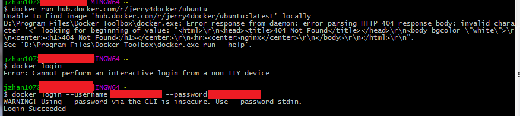

# Docker setup tips

[Docker Forum](https://forums.docker.com/)

[Install Docker ToolBox on Windows](https://docs.docker.com/toolbox/toolbox_install_windows/)
[Get Docker Toolbox for Windows](https://download.docker.com/win/stable/DockerToolbox.exe)

[jerry.hub.docker.com](https://hub.docker.com/r/jerry4docker/ubuntu/)

[完整记录在 windows7 下使用 docker 的过程](https://www.jianshu.com/p/d809971b1fc1)

[docker~在centos容器中安装新程序](https://www.cnblogs.com/lori/p/6703174.html)

## 如何修改Windows上Docker的镜像源

[如何修改Windows上Docker的镜像源](https://blog.csdn.net/wangdandong/article/details/68958210)

    docker-machine create --engine-registry-mirror=https://xxxxxxxx.mirror.aliyuncs.com -d virtualbox default

    EXTRA_ARGS='
    --registry-mirror=https://hub.docker.com/r
    --label provider=virtualbox

    '
    CACERT=/var/lib/boot2docker/ca.pem
    DOCKER_HOST='-H tcp://0.0.0.0:2376'
    DOCKER_STORAGE=aufs
    DOCKER_TLS=auto
    SERVERKEY=/var/lib/boot2docker/server-key.pem
    SERVERCERT=/var/lib/boot2docker/server.pem

    export "NO_PROXY=192.168.99.100"

## Win7 修改为阿里云镜像加速
### 1. 在阿里云查看给个人分配的镜像源地址: [俊杰的阿里云](https://cr.console.aliyun.com/cn-hangzhou/mirrors)
### 2. docker-machine ssh default
    sudo mkdir -p /etc/docker
    sudo tee /etc/docker/daemon.json <<-'EOF'
    {
      "registry-mirrors": ["https://r19oqqqv.mirror.aliyuncs.com"]
    }
    EOF 

## Docker: How to enable/disable HTTP Proxy in Toolbox

### step 1. 
    docker-machine ssh default

### step 2.
    sudo vi /var/lib/boot2docker/profile

### step 3.
    # replace with your office's proxy environment
    export "HTTP_PROXY=http://PROXY:PORT"
    export "HTTPS_PROXY=http://PROXY:PORT"
    # you can add more no_proxy with your environment.
### Please make sure disable NO_PROXY line in the /var/lib/boot2docker/profile
    if not, the docker could not connect to docker hub as docker ip is 192.168.*.*
    #export "NO_PROXY=192.168.99.*,*.local,169.254/16,*.example.com,192.168.59.*"

### step 4.
    sudo /etc/init.d/docker restart

### step 5. 
    exit

## After modify profile, for any docker command, there is:
    error during connect: Get https://192.168.99.100:2376/v1.37/info: dial tcp 192.168.99.100:2376: connectex: No connection could be made because the target machine actively refused it.
### in Win10, Please follow
    https://blog.csdn.net/pangdongh/article/details/80203103
### in Win7, Please follow

    docker-machine create -d virtualbox --engine-env HTTP_PROXY=http://xxx.xxx.xxx.xxx:8000 --engine-env HTTPS_PROXY=http://xxx.xxx.xxx.xxx:8000 --engine-env NO_PROXY=192.168.99.100 default

## Error response from daemon: error parsing HTTP 404 response body

## Cannot perform an interactive login from a non TTY device

[Docker Hub 仓库使用，及搭建 Docker Registry](https://segmentfault.com/a/1190000012662268)

[docker 学习笔记21：docker连接网络的设置](https://www.cnblogs.com/51kata/p/5268951.html)
    可以修改 /etc/default/docker 配置文件

    If you need Docker to use an HTTP proxy, it can also be specified here.
    export http_proxy="http://127.0.0.1:3128/"
    export http_proxy="http://代理地址:端口"
    docker run -it --rm ubuntu bash

### the input device is not a TTY.  If you are using mintty, try prefixing the command with 'winpty'

    switch from git bash to powershell

# ISSUE
    PS C:\Users\jzhan107> docker run jerry4docker/ubuntu4cplus
    Unable to find image 'jerry4docker/ubuntu4cplus:latest' locally
    D:\Program Files\Docker Toolbox\docker.exe: Error response from daemon: manifest for jerry4docker/ubuntu4cplus:latest not found.
    See 'D:\Program Files\Docker Toolbox\docker.exe run --help'.
    PS C:\Users\jzhan107> docker run -it --rm ubuntu4cplusplus /bin/bash
    Unable to find image 'ubuntu4cplusplus:latest' locally
    D:\Program Files\Docker Toolbox\docker.exe: Error response from daemon: pull access denied for ubuntu4cplusplus, repository does not exist or may require 'docker login'.
    See 'D:\Program Files\Docker Toolbox\docker.exe run --help'.
    PS C:\Users\jzhan107> docker login
    Login with your Docker ID to push and pull images from Docker Hub. If you don't have a Docker ID, head over to https://hub.docker.com to create one.
    Username (jerry4docker): jerry4docker
    Password:
    Login Succeeded
    PS C:\Users\jzhan107> docker run -it --rm ubuntu4cplusplus /bin/bash
    Unable to find image 'ubuntu4cplusplus:latest' locally
    D:\Program Files\Docker Toolbox\docker.exe: Error response from daemon: pull access denied for ubuntu4cplusplus, repository does not exist or may require 'docker login'.
    See 'D:\Program Files\Docker Toolbox\docker.exe run --help'.
# Command 
    docker-machine ip
    docker info
    docker run -i -t ubuntu /bin/bash
    apt-get update && apt-get install vim
    docker ps -a
    docker stop XX
    docker rm `docker ps -a -q`

## the input device is not a TTY.  If you are using mintty, try prefixing the command with 'winpty'
    jzhan107@CV0030804N0 MINGW64 ~
    $ docker attach e9a932d44224
    the input device is not a TTY.  If you are using mintty, try prefixing the command with 'winpty'

    jzhan107@CV0030804N0 MINGW64 ~
    $ winpty docker attach e9a932d44224
    root@e9a932d44224:/#

##  Unable to locate package vim-gtk
    root@e9a932d44224:/# apt-get install vim-gtk
    Reading package lists... Done
    Building dependency tree
    Reading state information... Done
    E: Unable to locate package vim-gtk
### first, 
    apt-get update
### then,
    apt-get install vim-gtk

### apt-get update连接不上
    进入 vi /etc/apt/sources.list 
    将网址修改为如下之一即可。

    163源

    deb http://mirrors.163.com/debian/ jessie main non-free contrib 
    deb http://mirrors.163.com/debian/ jessie-updates main non-free contrib 
    deb http://mirrors.163.com/debian/ jessie-backports main non-free contrib 
    deb-src http://mirrors.163.com/debian/ jessie main non-free contrib 
    deb-src http://mirrors.163.com/debian/ jessie-updates main non-free contrib 
    deb-src http://mirrors.163.com/debian/ jessie-backports main non-free contrib 
    deb http://mirrors.163.com/debian-security/ jessie/updates main non-free contrib 
    deb-src http://mirrors.163.com/debian-security/ jessie/updates main non-free contrib

    中科大源

    deb http://mirrors.ustc.edu.cn/debian jessie main contrib non-free 
    deb-src http://mirrors.ustc.edu.cn/debian jessie main contrib non-free 
    deb http://mirrors.ustc.edu.cn/debian jessie-proposed-updates main contrib non-free 
    deb-src http://mirrors.ustc.edu.cn/debian jessie-proposed-updates main contrib non-free 
    deb http://mirrors.ustc.edu.cn/debian jessie-updates main contrib non-free 
    deb-src http://mirrors.ustc.edu.cn/debian jessie-updates main contrib non-free

### windows下装的docker,pull下来的ubuntu:last没有vi这种命令啊，怎么办？vim 
    用 “docker attach 容器id” 进入容器后apt install vim就可以了。
    不过国内访问archive.ubuntu.com特别的慢，所以建议在建立容器时 docker run命令跟一个参数 
    -v 宿主机地址:容器内地址 这样的方式建立一个挂载关系
    如：docker run -it -p 3306:3306 --name=ubuntu -v /User/tester/dockerVolumns:/tmp
    这样就建立了自己主机上/User/tester/dockerVolumns目录和容器内tmp目录的绑定关系，那么tmp里面有任何的改动都会在主机的绑定目录下有反应，这个时候可以把/etc/apt/source.list复制出来，到／tmp里面去再 在主机上打开编辑器编辑好镜像仓库，再复制回/etc/apt这个目录里面去，最后apt update一下就可以使用国内的镜像仓库了。
    然后按照刚才说的 apt install vim就可以安装了。
    Linux的经典文本编辑器vi的使用,	基本的文件内容查看命令

### win下Docker默认存储位置修改
[win下Docker默认存储位置修改](https://chybeta.github.io/2017/02/14/win%E4%B8%8BDocker%E9%BB%98%E8%AE%A4%E5%AD%98%E5%82%A8%E4%BD%8D%E7%BD%AE%E4%BF%AE%E6%94%B9/)

 docker commit -m="new Linux system with gcc g++ ping openssl make vim installed" 49efe8bedaf4 jerry4docker/jerryubuntu:first